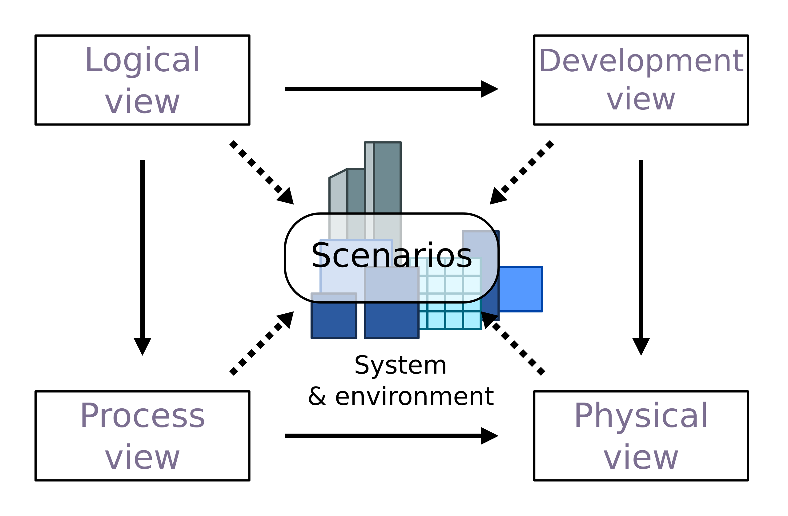

# Core Course Management Microservice

## Introduction and Overview

This project serves two purposes:

1. It an API to access information about courses, sections of courses, and enrollment/participation in sections
   of courses.
2. It is a simple example of a microservice participating in a full stack web application. This example
   supports the teaching material
   for [COMSW4153 -- Cloud Computing](https://donald-f-ferguson.github.io/W4153-Cloud-Computing-Base/) at Columbia
   University.

## High-Level Design

### Overview

We use a simple application of the [4+1 Architecture View Model](https://en.wikipedia.org/wiki/4%2B1_architectural_view_model) to provide the high-level design.

|  |
|:---------------------------------:|
|  __4+1 Architecture View Model__  |

### Logical Model

| <img src="assets/logical-1.jpg" width="500px" |
|:---------------------------------------------:|
|            __Core Logical Model__             |

The microservice has two dependencies:
1. A SQL database containing the persistent data for courses, sections and enrollments in sections.
For didactic reasons, this is a separate database project. This separation would make sense for a larger
more complex application. In a complex application, there would be a separation of developer roles,
skills and teams. 
   1. A team of "database developers" would implement the schema, constraints, triggers, functions/procedures,
      views, indexes, etc.
   2. A team of SW developers would write and test the microservice's application logic.

